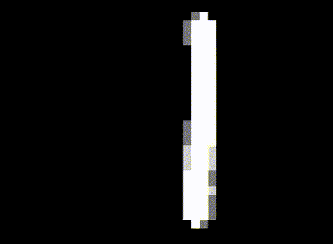

# Deep Genesis: MNIST Neural Network on Sega Genesis

Training MNIST digit recognition neural network using PyTorch and running inference directly on the Sega Genesis console hardware using SGDK (Sega Genesis Development Kit).



## 🎮 Overview

This project demonstrates the intersection of modern machine learning and retro gaming hardware by:

1. **Training**: Using PyTorch to train a simple neural network on the MNIST dataset;
2. **Converting**: Transforming the trained weights into C header files;
3. **Deploying**: Running inference on the actual Sega Genesis hardware using fixed-point arithmetic.

The neural network architecture is intentionally simple (784→40→40→10) to fit within the Genesis's memory constraints while still achieving good accuracy on digit recognition.

## 🔧 Requirements

### Python Environment

Make sure you have the following tools installed:

- [uv](https://www.github.com/astral-sh/uv) - Python version and dependency manager

### Genesis Development

- [SGDK (Sega Genesis Development Kit)](https://github.com/Stephane-D/SGDK);
- [BlastEm emulator](https://www.retrodev.com/blastem/). (optional, for testing)

### Environment Variables

Set these environment variables:

```bash
export SGDK_PATH=/path/to/sgdk
export BLASTEM_PATH=/path/to/blastem  # optional
```

## 🚀 Getting Started

### 1. Setup Python Environment

```bash
# Clone the repository
git clone https://github.com/Daniel-EST/deep-genesis.git
cd deep-genesis

# Install dependencies using uv (recommended)
uv sync
```

### 2. Train the Neural Network

```bash
# Train with default parameters (20 epochs, CPU)
just train

# Train with custom parameters
just train -e 50 -b 32 -d cuda
```

Training options:

- `-e, --epochs`: Number of training epochs (default: 20)
- `-l, --lr`: Learning rate (default: 0.001)
- `-b, --batch`: Batch size (default: 64)
- `-d, --device`: Device ("cpu", "cuda", "mps")
- `--save-images`: Save test predictions as images

### 3. Convert Weights for Genesis

The weights are automatically converted after training, but you can also run manually:

```bash
just convert-weights
```

### 4. Build Genesis ROM

```bash
# Build the Genesis ROM
just build

# Build and run in emulator
just build && just play
```

### 5. Test Python Inference

```bash
# Test with a sample image
just predict path/to/image.png

# Use custom weights
just predict path/to/image.png -w ./data/models/custom.pt
```

## 🧠 Neural Network Architecture

The model uses a really simple fully-connected architecture:

```
Input Layer:    784 neurons (28×28 flattened image)
Hidden Layer 1: 40 neurons (ReLU activation)
Hidden Layer 2: 40 neurons (ReLU activation)
Output Layer:   10 neurons (digit classes 0-9)
```

## 🛠️ Available Commands

Using [Just](https://github.com/casey/just) for task automation:

```bash
just build [args]           # Build Genesis ROM
just play                   # Run ROM in BlastEm emulator
just train [args]          # Train neural network
just predict [args]        # Run Python inference
just convert-image [args]  # Convert image to C headers
just convert-weights       # Convert weights to C headers
just clean                 # Clean build artifacts
just help                  # Show all commands
```

## 🎨 Visualization

When training with `--save-images`:

- Test predictions are saved with ground truth labels;
- Useful for debugging and analysis.

When running on Genesis:

- Input image is displayed as a grayscale visualization;
- Logit scores for each digit (0-9) and prediction are shown.

## TODO:

- Convolutional layers (if memory permits);
- Improve Softmax implementation;
- Multiple input images;
- Real-time drawing interface;
- Performance optimizations;
- Test on real hardware.

## 🙏 Acknowledgments

- [SGDK](https://github.com/Stephane-D/SGDK) by Stephane Dallongeville
